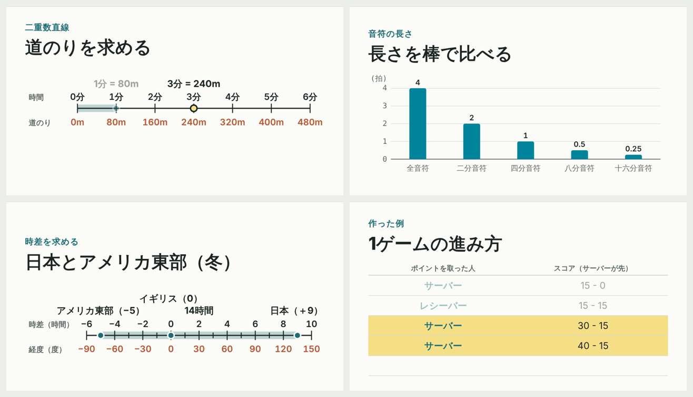

# 学習カセット（lesson-cassette）

説明動画を、**カセット**（JSON 1 ファイル）と **プレイヤー**（HTML 1 枚）に分けて作る仕組み。台本を書くと、検証・音声合成・時刻表づくりを経て、どの端末でも同じように再生できるカセットになる。



```
lessons/*.yaml ──検証──┬─(--draft)──────────────→ dist/<id>.cassette.json（下書き：端末の読み上げで再生）
                      └─音声合成・時刻表・圧縮──→ dist/<id>.cassette.json（音声入り：どの端末でも同じ）
dist/player.html … 空のプレイヤー。カセットを選ぶかドロップして再生
```

- 画面は時刻だけで決まる（どこに飛んでも同じ画面）。字幕・目次・台本の全文・出典が付く
- 声は Open JTalk（淡々とした読み）。読み違いは台本の `say` か読み辞書で直す
- 台本は AI に書かせる前提で、形式（`SPEC.md`）と書き方・確かめ方（`AUTHORING.md`）を文書にしてある

## すぐ試す

`dist/player.html` をブラウザで開き、「カセットを読み込む」で `dist/` のカセットを選ぶ（インストール不要）。

| カセット | 内容 | 長さ | 主な部品 |
|---|---|---|---|
| `how-it-works` | この仕組みの紹介 | 1:11 | 箇条書き・比較・手順 |
| `parts-catalog` | 画面の部品の見本 | 2:11 | 換算表・2軸の表・数直線・棒／折れ線グラフ・線分 |
| `speed-distance-time` | 速さ・時間・道のりの関係（算数） | 6:21 | 二重数直線・2軸の表・換算表・折れ線・線分 |
| `tennis-scoring` | テニスの点数の数え方 | 4:26 | 値の表・手順・問い |
| `notes-and-meter` | 音符の長さと拍子（音楽） | 4:07 | 棒グラフ・数直線・表 |
| `time-difference` | 時差のしくみ（地理） | 3:53 | 二重数直線（負の数）・表 |

`how-it-works` 以外の 5 本は、数値を `lessons/<id>.verify.py` で検算してある（`python3 lessons/<id>.verify.py`）。

## 中身

| パス | 役割 |
|---|---|
| `SPEC.md` | カセット形式 v1 の仕様（部品の一覧・検証ルール・書き手への約束）。AI に台本を書かせるときに渡す |
| `AUTHORING.md` | 台本の書き方ガイド（構成の型・部品の選び方・読みの決まりと読み違いの例・確かめ方） |
| `lessons/` | 台本（YAML）と検算スクリプト（`<id>.verify.py`）。`parts-catalog.yaml` は部品の見本 |
| `readings.yaml` | 読み辞書。語の読みを 1 か所で決め、全カセットに効かせる（例：値の表 → あたいのひょう）。個人の固有名詞などは `readings.local.yaml`（リポジトリに入れない）に書く |
| `tools/cassette.py` | 検証。`python3 tools/cassette.py lessons/*.yaml` で単体実行もできる |
| `tools/build_cassette.py` | 台本 → カセット（下書き／音声入り） |
| `tools/build_player.py` | プレイヤーを 1 ファイルに組み立てる（サンプル同梱版も作れる） |
| `tools/engines.py` | 音声合成エンジン（Open JTalk） |
| `tools/try_voice.py` | 試し聞き（台本の最初の数行だけ合成して WAV に保存） |
| `tools/qa.py` | 品質チェック（形式・長さ・全行のかな読み・グラフと表の照合・画面のはみ出しと崩れ）。`qa/<id>/` に報告と一覧画像を出す |
| `tools/check_parity.py` | Python の検証とプレイヤーの検証が同じ結果を返すかを確かめる（Chromium が必要） |
| `tests/` | `test_qa.py`：わざと誤りを入れた台本（`tests/fixtures/`）で、`qa.py` が誤りを拾うかを確かめる |
| `player/` | プレイヤーの部品（HTML の骨組み・CSS・JS） |
| `dist/` | 出力（カセット・プレイヤー） |
| `LICENSE`・`LICENSE-CONTENT.md` | ライセンス（コードは MIT、教材は CC BY 4.0、音声は CC BY 3.0 の声） |
| `cache/`・`qa/` | 行ごとの合成済み音声と、`qa.py` の出力。どちらも消してよい（リポジトリに入れない） |

## 準備（初回だけ）

Mac の例。Python 3.12 と ffmpeg が要る。

```bash
brew install python@3.12 cmake ffmpeg
python3.12 -m venv .venv && source .venv/bin/activate
pip install pyopenjtalk budoux pyyaml numpy
```

- `pyopenjtalk` は PyPI にソースしかないため、cmake を使ってビルドされる
- 初回の合成時に、辞書（約 23MB）が自動で取得される
- `qa.py` の画面チェックと検算には、さらに `pip install sympy pillow playwright && python -m playwright install chromium` が要る（なければ画面チェックだけ飛ばす）。Playwright が入れた Chromium 以外を使うときは、環境変数 `CHROMIUM_PATH` にその場所を書く

## 使い方

```bash
source .venv/bin/activate
python tools/cassette.py lessons/my-topic.yaml                        # 検証だけ
python tools/build_cassette.py lessons/my-topic.yaml --draft           # 下書きカセット（音声なし）
python tools/try_voice.py lessons/my-topic.yaml --lines 5              # 読み上げの試し聞き（samples/ に保存）
python tools/qa.py lessons/my-topic.yaml                               # 品質チェック（qa/my-topic/report.md）
python tools/build_cassette.py lessons/my-topic.yaml                   # 音声入りカセット
python tools/build_player.py                                          # dist/player.html を作る
```

台本の作り方の流れ（`AUTHORING.md` に詳しく書いてある）：

```
依頼（資料・URL・テーマ）
  → 構成 → 台本（lessons/<id>.yaml）
  → qa.py（要対応 0 まで）＋ 読みの全行確認 ＋ 検算（lessons/<id>.verify.py）＋ 事実の照合 ＋ 一覧画像
  → 音声入りにビルド → もう一度 qa.py
```

- 作者の環境では、この流れを Claude のスキルにして、「〇〇をカセットにして」と頼むだけで作れるようにしている（スキル自体はこのリポジトリに含まない）
- 2026-10-06・10-08 に、別の AI にスキルの文面だけで台本を作らせる試運転をした。出た指摘で、プレイヤー・`qa.py`・ビルド・`AUTHORING.md` を直した（`speed-distance-time` はその試運転で作った台本を仕上げたもの）

### 道具を直したときの確かめ方

```bash
python3 tools/check_parity.py     # 検証の Python 版と JS 版が一致するか
python3 tests/test_qa.py          # qa.py が、わざと入れた誤りを拾うか
for f in dist/*.cassette.json; do python3 tools/qa.py $f; done   # 全カセットで要対応 0 か
```

## 声について

### 下書き（ブラウザ読み上げ）の声
- プレイヤーは日本語の声を品質順に並べ、いちばん良いものを自動で選ぶ。下書きを再生中は、操作欄の選択欄から手動で変えられる（選んだ声は記憶される）
- 優先順：Microsoft Nanami／Keita（Edge）→ Google 日本語（Chrome）→ Hattori → O-Ren → Kyoko → Otoya。Eddy・Flo・Grandma などの遊び用の声は最後に回す
- Mac・iPhone では「設定 → アクセシビリティ → 読み上げコンテンツ → 声 → 日本語」で、Kyoko や O-Ren の高品質版（拡張・プレミアム）を追加できる

### 音声入りの声：Open JTalk
- 無機質で安定した読みを優先して Open JTalk を標準にしている
- 読み間違いは、その行に `say`（読み上げ用の文）を書いて直す。数字の直後の `m` `g` `L` はビルドが「メートル」「グラム」「リットル」と読む
- 経緯：Qwen3-TTS（Apache 2.0）も試したが、日本語話者が「遊び心のある声」の 1 人だけで抑揚が大きく、抑揚を縮める処理を足しても話し方の癖が残ったため採用しなかった

## 再現性の確かめ方

ビルドの最後に 3 つの指紋が表示される（カセット内の `build` にも記録される）。

| 指紋 | 何が同じなら一致するか | マシンをまたいで一致するか |
|---|---|---|
| 内容（`content_hash`） | 台本・画面・時刻表・圧縮前の音声 | する |
| 音声（圧縮前）（`pcm_sha`） | 合成した音声そのもの | する（pyopenjtalk の版が同じなら） |
| ファイル sha256 | 上の 2 つ＋圧縮後のバイト列 | しない場合がある（ffmpeg の版で変わる） |

- 別のマシンで作ったカセットが「同じもの」かは、**内容** と **音声（圧縮前）** で判断する
- 同じマシンで作り直したときは、ファイル sha256 まで一致する
- 音声は `cache/` に行ごとに保存される。台詞を 1 行直しても、合成し直すのはその行だけ
- 2026-10-06 確認：Mac（ffmpeg 9.0.2）と Linux（ffmpeg 6.1.1）で、`how-it-works` の内容 `731e953ba64b`・音声（圧縮前）`df22d48adb75109f` が一致。ファイル sha256 だけが ffmpeg の版の違いで不一致（AAC 圧縮後のサイズが 423KB と 419KB）

## 権利

- 音声：Open JTalk（pyopenjtalk は MIT、Open JTalk 本体は修正 BSD）
- 声：HTS Voice「Mei」© Nagoya Institute of Technology（配布：MMDAgent Project）、[CC BY 3.0](https://creativecommons.org/licenses/by/3.0/)。`dist/*.cassette.json` の音声はこの声で合成したもので、カセットの `audio.credit` に表記があり、プレイヤーにも表示される。カセットを配るときは、このクレジットを消さない
- 文節区切り：BudouX（Apache 2.0）
- プレイヤーと道具のコードは、このプロジェクトのために書いたもの
- サンプルの台本の事実は、各カセットの出典（`sources`）に書いた資料で確かめた。資料の文章は書き写さず、要点を自分の言葉で説明している
- このリポジトリのライセンス：コードは MIT（`LICENSE`）、台本・カセット・文書は CC BY 4.0、音声は声「Mei」の CC BY 3.0 に従う。分け方は `LICENSE-CONTENT.md` に書いた
